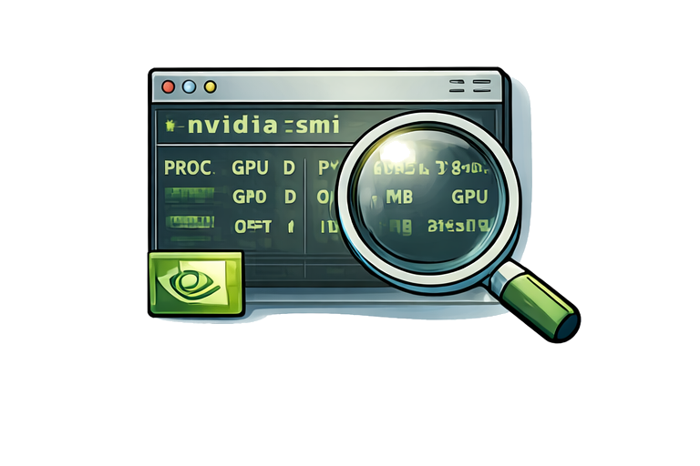

<h1 class="centered">Inspecting a live GPU job</h1>

{width="500" .centered}

When a GPU job is running on the cluster you may want to check how well the GPU is actually being utilised — without interrupting or resubmitting the job. The `srun --overlap` technique lets you drop an interactive shell onto the exact node where your job is executing, giving you full access to nvidia-smi while the workload continues undisturbed.

{width=800, align=center}

<div class="dracula" markdown="1">

## Getting onto the node

```py
srun --overlap --jobid <JOBID> --pty bash
```

!!! circle-info ""
    * The `--overlap` flag is the key ingredient. By default Slur refuses to start a new step inside an allocation that is already fully occupied. Passing `--overlap` tells Slurm to inject your interactive step into the running job's allocation, sharing the same node without displacing the original job. Once the shell opens you are sitting directly on the GPU node alongside your workload.
    * Your `<JOBID>` is available from `squeue --me`.

    **Important**

    * `--overlap` directive only works when the job is at `RUNNING` state. Executing the above command while the job is still `PENDING` will trigger the following error 

    ```py
    srun: error: Unable to confirm allocation for job JOIBD: Job is pending execution
    srun: Check SLURM_JOB_ID environment variable. Expired or invalid job JOBID
    ```


## Checking GPU utilisation

From inside the interactive shell, run:

```py
nvidia-smi
```


This gives a snapshot of every GPU on the node: the device model, current utilisation percentage (the key metric — close to 100% is ideal for a compute-bound workload), memory used versus total capacity, temperature, and the processes attached to each device. Your job's process should appear in the process table at the bottom with its PID and memory footprint.

For a live view that refreshes every second:

```py
watch -n 5 nvidia-smi
```
Low utilisation (say, under 50%) while the job is running is a common indicator of a CPU bottleneck, slow data loading, or excessive host–device memory transfers — all worth investigating with a more detailed profiler such as Nsight Systems.

### Sample output and how to identify your GPU processes

??? circle-info "Sample `nvidia-smi` output"

    ```python
    ➜  nvidia-smi 
    Thu Apr  2 14:28:29 2026       
    +-----------------------------------------------------------------------------------------+
    | NVIDIA-SMI 580.126.09             Driver Version: 580.126.09     CUDA Version: 13.0     |
    +-----------------------------------------+------------------------+----------------------+
    | GPU  Name                 Persistence-M | Bus-Id          Disp.A | Volatile Uncorr. ECC |
    | Fan  Temp   Perf          Pwr:Usage/Cap |           Memory-Usage | GPU-Util  Compute M. |
    |                                         |                        |               MIG M. |
    |=========================================+========================+======================|
    |   0  Quadro RTX 6000                On  |   00000000:3B:00.0 Off |                  Off |
    | 46%   70C    P2            239W /  260W |   19124MiB /  24576MiB |    100%      Default |
    |                                         |                        |                  N/A |
    +-----------------------------------------+------------------------+----------------------+
    |   1  Quadro RTX 6000                On  |   00000000:5E:00.0 Off |                  Off |
    | 33%   29C    P8             29W /  260W |       1MiB /  24576MiB |      0%      Default |
    |                                         |                        |                  N/A |
    +-----------------------------------------+------------------------+----------------------+
    |   2  Quadro RTX 6000                On  |   00000000:AF:00.0 Off |                  Off |
    | 33%   31C    P8             29W /  260W |       1MiB /  24576MiB |      0%      Default |
    |                                         |                        |                  N/A |
    +-----------------------------------------+------------------------+----------------------+
    |   3  Quadro RTX 6000                On  |   00000000:D8:00.0 Off |                  Off |
    | 33%   32C    P8             23W /  260W |       1MiB /  24576MiB |      0%      Default |
    |                                         |                        |                  N/A |
    +-----------------------------------------+------------------------+----------------------+

    +-----------------------------------------------------------------------------------------+
    | Processes:                                                                              |
    |  GPU   GI   CI              PID   Type   Process name                        GPU Memory |
    |        ID   ID                                                               Usage      |
    |=========================================================================================|
    |    0   N/A  N/A          946316      C   ./gpu_burn                            19120MiB |
    +-----------------------------------------------------------------------------------------+
    ```

Running `nvidia-smi` on a shared node shows all GPU processes from all users, with only the binary name in the Process name column — there is no ownership information. On a node with multiple users running jobs with the same command ( let's say python3,etc), it is impossible to tell which processes are yours from the standard output alone.

The `--query-compute-apps` flag exposes PIDs in a parseable form, which can be cross-referenced against the OS process table. The following one-liner filters GPU processes to only those owned by $USER and resolves the GPU UUID to a human-readable index:

```py
nvidia-smi --query-compute-apps=gpu_uuid,pid,process_name,used_gpu_memory \
  --format=csv,noheader,nounits \
| awk -F', ' -v user=$USER '{
    cmd = "ps -o user= -p " $2 " 2>/dev/null"
    cmd | getline owner; close(cmd)
    if (owner == user) {
      cmd2 = "nvidia-smi --query-gpu=index --format=csv,noheader --id=" $1
      cmd2 | getline idx; close(cmd2)
      print "GPU " idx "\tPID " $2 "\t" $3 "\t" $4 " MiB"
    }
  }'
```

```python
GPU 0	PID 946316	./gpu_burn	19120 MiB
```
!!! quote ""

    The UUID returned by --query-compute-apps (e.g. GPU-91bec788-...) does not directly correspond to the index shown in nvidia-smi's main table. The inner nvidia-smi --query-gpu=index --id=<UUID> call resolves this — the --id flag accepts a UUID directly, so the correct index is looked up without any fragile string parsing of the main output.

### Exiting

Type `exit` or press `Ctrl-D` to close the interactive session. This terminates only the `srun` step; your batch job continues running on the node completely unaffected.

## Summary 

<video width="100%" controls>
  <source src="https://raw.githubusercontent.com/kir-rescomp/training-gpu-profiling/main/docs/images/srun_overlap.webm" type="video/mp4">
  Your browser does not support the video tag.
</video>


</div>