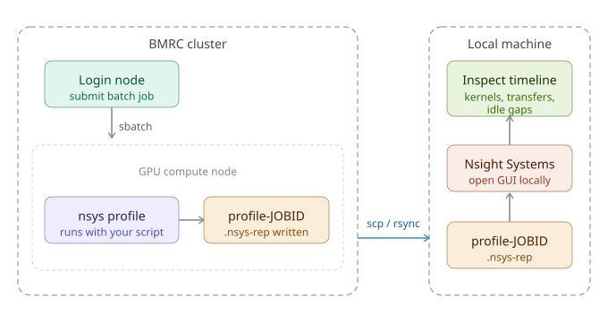
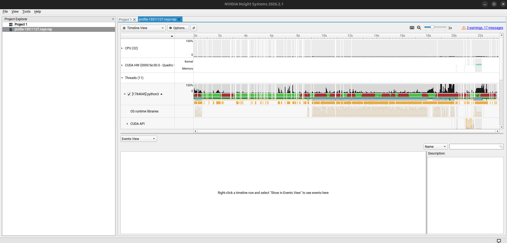

<h1 class="centered">Advanced: profiling GPU code with Nsight Systems</h1>

{width="500" .centered}

`nvidia-smi` used in previous episodes tells you whether your GPU is being used — `Nsight Systems` tells you why it isn't being used 
as much as it should be. It produces a detailed timeline of CUDA kernel execution, memory transfers between 
host and device, and CPU-side activity, making it possible to pinpoint bottlenecks such as data loading stalls, 
excessive host–device transfers, or poorly overlapping compute and I/O.

## The cluster workflow



Nsight Systems has no display requirement at the collection stage. The profiler runs entirely from the command line 
inside your batch job and writes a self-contained `.nsys-rep` report file, which you then download and open in the 
Nsight Systems GUI on your local machine. Install the GUI on your laptop from the NVIDIA Nsight Systems download page.


## Instrumenting your batch script

<div class="dracula" markdown="1">

```rust
#!/bin/bash

#SBATCH --job-name=nsys-profile
#SBATCH --partition=gpu_interactive
#SBATCH --gres=gpu:1

# CUDA module provides the nsys binary
module load CUDA/12.6.0

# Prefix your Python invocation with nsys profile:
nsys profile \
  --output=profile-${SLURM_JOB_ID} \
  --trace=cuda,nvtx,osrt \
  --cudabacktrace=true \
  python3 train.py
```

This produces `profile-<JOBID>.nsys-rep` in your working directory. The `--trace` flags control what is captured — `cuda` 
for kernel and memory transfer timelines, `nvtx` for any manual annotation ranges you add (see below), and osrt for 
OS runtime calls such as `sleep` and `pthread` activity.

## Example

The following short PyTorch script deliberately includes a common inefficiency — repeated small host-to-device transfers 
inside the training loop — so the profiler has something interesting to show:

```py
import torch
import torch.nn as nn

device = torch.device("cuda")

model = nn.Sequential(
    nn.Linear(1024, 2048),
    nn.ReLU(),
    nn.Linear(2048, 1024),
).to(device)

# Inefficient: data moved to device inside the loop on every step
for step in range(200):
    x = torch.randn(64, 1024)          # created on CPU
    x = x.to(device)                   # transferred each iteration
    loss = model(x).sum()
    loss.backward()
```

In the Nsight Systems timeline you will see a recurring pattern of short `cudaMemcpy` calls (host→device) preceding 
each forward pass kernel, with the GPU sitting idle during the transfer. Moving `x = torch.randn(64, 1024, device=device)` outside the loop eliminates these transfers and the idle gaps disappear.

### Adding NVTX annotations

For longer scripts it is useful to label regions of your code so they appear as named spans in the timeline:

```python
import nvtx

with nvtx.annotate("data loading", color="blue"):
    x = x.to(device)

with nvtx.annotate("forward pass", color="green"):
    loss = model(x).sum()
```

`nvtx` is available via `pip install nvtx`. The named spans appear as coloured bars in the Nsight Systems timeline directly above the CUDA activity, making it easy to correlate your code structure with GPU behaviour.


### Viewing the report

1. Copy the `.nsys-rep` file to your local machine:

2. Open it in the Nsight Systems GUI. The main view is a timeline with rows for CUDA API calls, kernel execution, memory operations, and NVTX ranges. Key things to look for:
    - Gaps in the CUDA row — the GPU is idle, usually waiting on the CPU or a data transfer
    - Long c`udaMemcpy` spans — excessive host–device transfers
    - Short, fragmented kernels — the overhead of launching many small kernels may outweigh their compute



For kernel-level analysis (occupancy, memory bandwidth, warp efficiency) the companion tool `ncu` (Nsight Compute) goes deeper, though it is significantly slower to collect and is usually the second step after identifying the bottleneck kernel with Nsight Systems first.

</div>