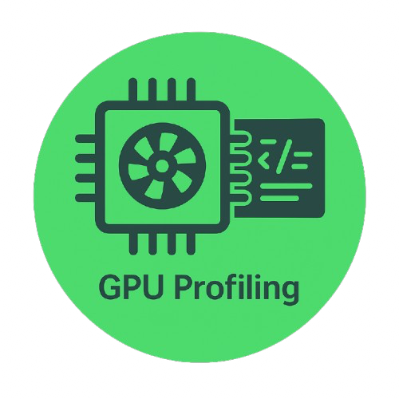

  <a href="https://kir-rescomp.github.io/kir-training-home/">← Return to KIR Training Catalogue</a>

<h1></h1>

    

!!! table "Table of contents"

    1. [Choosing a GPU for your workload](./1.choosing_the_correctgpu.md) 
    2. [Inspecting a live GPU job with `srun --overlap`](./2.srun_overlap.md)
    3. [Instrumenting a Slurm batch script for GPU monitoring](./3.nvidiasmi_on_slurmscript.md)
    4. [Advanced: profiling GPU code with Nsight Systems](./4.nsight-systems.md)

- - -
