# Inspecting a live GPU job

When a GPU job is running on the cluster you may want to check how well the GPU is actually being utilised — without interrupting or resubmitting the job. The `srun --overlap` technique lets you drop an interactive shell onto the exact node where your job is executing, giving you full access to nvidia-smi while the workload continues undisturbed.

{width=800, align=center}

<div class="dracula" markdown="1">

## Getting onto the node

```py
srun --overlap --jobid <JOBID> --pty bash
```

!!! circle-info ""
    * The `--overlap` flag is the key ingredient. By default Slur refuses to start a new step inside an allocation that is already fully occupied. Passing `--overlap` tells Slurm to inject your interactive step into the running job's allocation, sharing the same node without displacing the original job. Once the shell opens you are sitting directly on the GPU node alongside your workload.
    * Your `<JOBID>` is available from `squeue --me`.

    **Important**

    * `--overlap` directive only works when the job is at `RUNNING` state. Executing the above command while the job is still `PENDING` will trigger the following error 

    ```py
    srun: error: Unable to confirm allocation for job JOIBD: Job is pending execution
    srun: Check SLURM_JOB_ID environment variable. Expired or invalid job JOBID
    ```


## Checking GPU utilisation

From inside the interactive shell, run:

```py
nvidia-smi
```


This gives a snapshot of every GPU on the node: the device model, current utilisation percentage (the key metric — close to 100% is ideal for a compute-bound workload), memory used versus total capacity, temperature, and the processes attached to each device. Your job's process should appear in the process table at the bottom with its PID and memory footprint.

For a live view that refreshes every second:

```py
watch -n 5 nvidia-smi
```
Low utilisation (say, under 50%) while the job is running is a common indicator of a CPU bottleneck, slow data loading, or excessive host–device memory transfers — all worth investigating with a more detailed profiler such as Nsight Systems.

### Exiting

Type `exit` or press `Ctrl-D` to close the interactive session. This terminates only the `srun` step; your batch job continues running on the node completely unaffected.


</div>